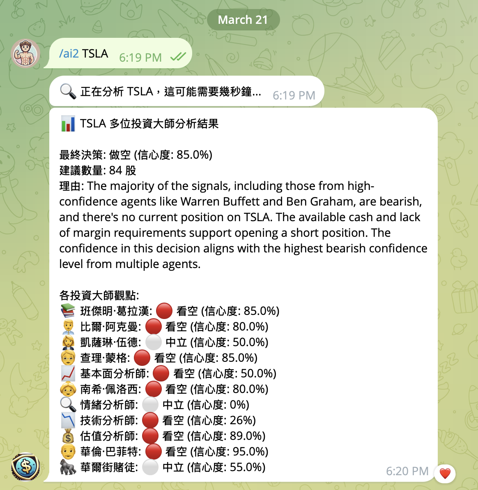
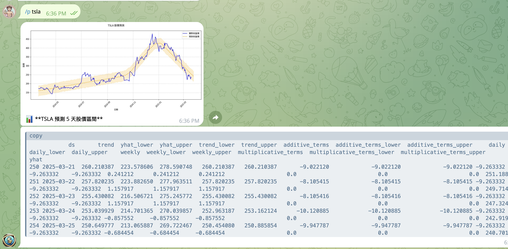
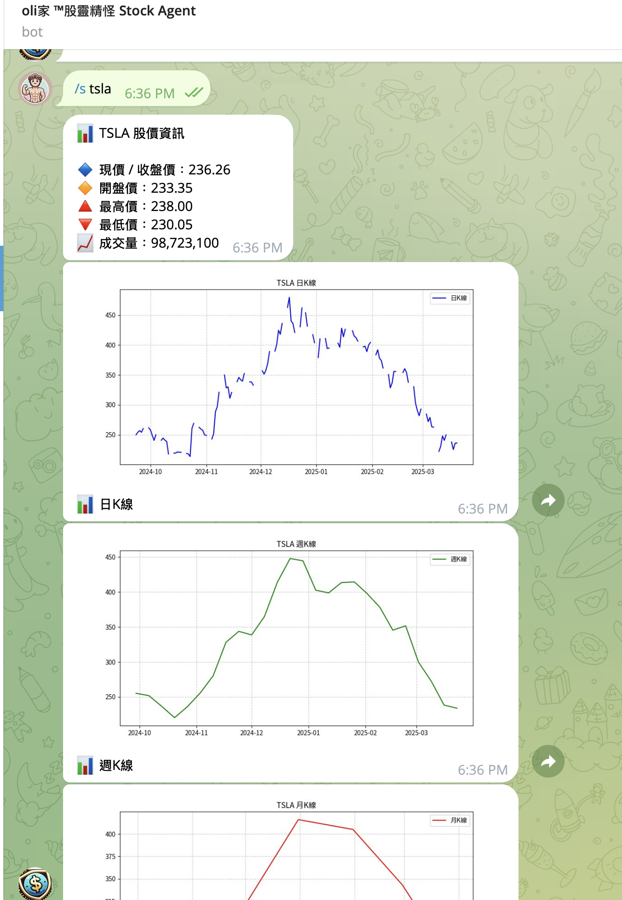

# Telegram 股票資訊機器人

## 功能簡介

這是一個基於 Python 和 `python-telegram-bot` 開發的 **Telegram 股票資訊機器人**，提供即時股票數據查詢、K 線圖生成，股價預測功能，以及強大的基本面分析和 AI 智能回應。  
目前支援 **台股** 和 **美股** 股票。







### 功能列表：

1. **股價查詢與 K 線圖**
   - `/s 股票代碼`：查詢最新股價、開盤價、收盤價、最高價、最低價、成交量，並提供日K、週K 和月K 線圖。

2. **美股新聞查詢**
   - `/n 股票代碼`：查詢美股股票的最新相關新聞。

3. **台股新聞查詢**
   - `/ny 股票代碼`：查詢 Yahoo 台股新聞。

4. **股價預測功能**
   - `/p 股票代碼`：使用 Prophet 模型預測未來 5 天的股價範圍。

5. **AI 基本面分析**
   - `/ai 股票代碼`：使用 LangGraph 和多個工具進行深度基本面分析，包含：
     - 技術指標分析（RSI、MACD、VWAP、隨機指標）
     - 財務健康度評估（P/E、P/B、負債權益比、利潤率等）
     - 最新新聞與市場情緒分析
     - 綜合投資建議（買入/持有/賣出）

6. **投資大師集體分析**
   - `/ai2 股票代碼`：連接專業投資分析 API，提供多位知名投資大師的集體分析：
     
     **價值投資大師 (7位)：**
     - 👴 華倫·巴菲特 (Warren Buffett) - 長期價值投資，尋找優質企業
     - 🧓 查理·蒙格 (Charlie Munger) - 品質投資，尋找護城河與高 ROE
     - 📚 班傑明·葛拉漢 (Ben Graham) - 價值投資之父，重視安全邊際
     - 👨‍💼 比爾·阿克曼 (Bill Ackman) - 激進價值投資，專注優質企業
     - 😏 麥可·貝瑞 (Michael Burry) - 深度價值投資，尋找被低估資產
     - 🤠 彼得·林區 (Peter Lynch) - 成長價值投資，重視 PEG Ratio
     - 📖 菲爾·費雪 (Phil Fisher) - 成長潛力分析，重視研發與管理品質
     
     **成長與創新 (1位)：**
     - 👩‍💼 凱西·伍德 (Cathie Wood) - 顛覆式創新投資，聚焦 AI、電動車、基因科技
     
     **技術與情緒分析 (4位)：**
     - 👵 南希·佩洛西 (Nancy Pelosi) - 追蹤國會議員股票交易記錄
     - 🦍 華爾街賭場 (WallStreetBets) - Reddit 社群情緒、散戶動能分析
     - 📉 技術分析師 (Technical Analyst) - MA、RSI、MACD 等技術指標
     - 🔍 情緒分析師 (Sentiment Analyst) - 新聞情緒分析、市場氛圍評估
     
     **基本面與估值分析 (2位)：**
     - 📈 基本面分析師 (Fundamentals Analyst) - 深度財務報表分析
     - 💰 估值分析師 (Valuation Analyst) - 企業估值模型、DCF 分析
     
     - 最終給出綜合決策建議（買入/賣出/持有/做空）及信心度評分

7. **LLM 智能回答**
   - `/llm 問題`：連接 DIFY LLM API，使用先進的語言模型回答股票相關問題：
     - 支援串流式回應，即時顯示 AI 分析結果
     - 可詢問任何股票相關問題，如：`/llm AVGO 的股價前景如何？`
     - 適合配合 `/ai` 或 `/ai2` 指令使用，進行深度問答

8. **其他工具連結**
   - `/h`：顯示其他股票預測工具的連結。

## 技術架構

本機器人採用先進的技術架構：

- **資料獲取**：使用 `yfinance` 獲取即時股票數據
- **數據視覺化**：使用 `matplotlib` 生成專業金融圖表
- **網頁爬蟲**：使用 `BeautifulSoup` 爬取最新財經新聞
- **AI 模型整合**：
  - 使用 `LangGraph` 和 `LangChain` 構建工具鏈進行基本面分析
  - 整合 `Prophet` 模型進行股價預測
- **自然語言處理**：連接外部 LLM API 提供智能回答

### 基本面分析工具

`/ai` 命令使用了三種核心工具進行全面分析：

- **get_stock_prices**：獲取股價和技術指標（RSI、MACD、VWAP、KD 隨機指標）
- **get_financial_metrics**：獲取關鍵財務指標（P/E、P/B、負債權益比、利潤率等）
- **get_financial_news**：獲取最新新聞並分析其對市場情緒的影響

---

## 部署方式

### 使用 Docker 執行

若要快速啟動機器人，可直接從 Docker Hub 下載映像並執行：

```bash
docker pull tbdavid2019/telegram-bot-stock2:latest
```

啟動容器時需指定 Telegram Bot Token 和 OpenAI API Key（用於 AI 功能）：

```bash
docker run -d --name telegram-bot-stock2 \
  -e TELEGRAM_BOT_TOKEN=<你的 Telegram Bot Token> \
  -e OPENAI_API_KEY=<你的 OpenAI API Key> \
  -e OPENAI_MODEL=gpt-4o \
  -e OPENAI_BASE_URL=<選填: 自訂 API 端點> \
  -e DIFY_API_KEY=<你的 DIFY API Key> \
  -e DIFY_BASE_URL=<選填: 預設為 http://llm.glsoft.ai/v1/chat-messages> \
  tbdavid2019/telegram-bot-stock2:latest
```

### 手動部署

#### 環境需求

- Python 3.9+
- 相關套件（已列於 requirements.txt）

#### 步驟

1. 安裝必要套件：
```bash
pip install -r requirements.txt
```

2. 設置環境變數：
創建 .env 檔案，並輸入必要的 API Keys：
```
TELEGRAM_BOT_TOKEN=你的 Telegram Bot Token
OPENAI_API_KEY=你的 OpenAI API Key
OPENAI_MODEL=gpt-4o  # 選填，預設為 gpt-4o，可改為其他模型如 gpt-3.5-turbo
OPENAI_BASE_URL=     # 選填，若使用代理服務請填入，例如: https://your-proxy.com/v1
DIFY_API_KEY=你的 DIFY API Key
DIFY_BASE_URL=http://llm.glsoft.ai/v1/chat-messages  # 選填，預設為此網址
```

3. 啟動機器人：
```bash
python main.py
```

## 指令列表

| 指令 | 功能描述 | 使用範例 |
|------|---------|---------|
| `/start` | 啟動機器人 | `/start` |
| `/s` | 查詢股價與 K 線圖 | `/s 2330.TW` |
| `/n` | 查詢美股新聞 | `/n TSLA` |
| `/ny` | 查詢台股新聞 | `/ny 2330.TW` |
| `/p` | 預測未來 5 天股價區間 | `/p TSLA` |
| `/ai` | 綜合基本面分析評估投資價值 | `/ai TSLA` |
| `/ai2` | 多位投資大師集體分析 | `/ai2 NVDA` |
| `/llm` | 使用 LLM 回答股票相關問題 | `/llm AVGO 的股價前景如何？` |
| `/h` | 顯示其他股票工具連結 | `/h` |

## 貢獻

歡迎貢獻！請透過 Pull Request 提交您的修改或改進建議。

---

# Telegram Stock Information Bot (English)

## Overview

This is a Telegram Stock Information Bot built with Python and python-telegram-bot, capable of retrieving real-time stock data, generating K-line charts, forecasting stock prices, and providing AI-powered fundamental analysis.

It supports Taiwan Stock Exchange (TWSE) and U.S. Stocks.

## Features:

1. **Stock Price and K-line Charts**
   - `/s <stock_code>`: Retrieve the latest stock price, open, close, high, low prices, trading volume, and generate daily, weekly, and monthly K-line charts.

2. **U.S. Stock News**
   - `/n <stock_code>`: Retrieve the latest news for U.S. stocks.

3. **Taiwan Stock News**
   - `/ny <stock_code>`: Fetch Taiwan stock news from Yahoo.

4. **Stock Price Prediction**
   - `/p <stock_code>`: Predict the next 5 days' stock price range using the Prophet model.

5. **AI Fundamental Analysis**
   - `/ai <stock_code>`: Uses LangGraph and multiple tools for in-depth fundamental analysis, including:
     - Technical indicator analysis (RSI, MACD, VWAP, Stochastic Oscillator)
     - Financial health assessment (P/E, P/B, Debt-to-Equity, Profit Margins, etc.)
     - Latest news and market sentiment analysis
     - Comprehensive investment recommendations (Buy/Hold/Sell)

6. **Investment Gurus Analysis**
   - `/ai2 <stock_code>`: Connects to professional investment analysis API, providing collective analysis from multiple renowned investors:
     
     **Value Investing Masters (7):**
     - 👴 Warren Buffett - Long-term value investing, seeking quality companies
     - 🧓 Charlie Munger - Quality investing, seeking moats and high ROE
     - 📚 Ben Graham - Father of value investing, emphasizes margin of safety
     - 👨‍💼 Bill Ackman - Activist value investing, focuses on quality businesses
     - 😏 Michael Burry - Deep value investing, seeks undervalued assets
     - 🤠 Peter Lynch - Growth-at-reasonable-price, emphasizes PEG Ratio
     - 📖 Phil Fisher - Growth potential analysis, values R&D and management quality
     
     **Growth & Innovation (1):**
     - 👩‍💼 Cathie Wood - Disruptive innovation investing, focuses on AI, EVs, genomics
     
     **Technical & Sentiment Analysis (4):**
     - 👵 Nancy Pelosi - Tracks congressional stock trading records
     - 🦍 WallStreetBets - Reddit community sentiment, retail momentum analysis
     - 📉 Technical Analyst - MA, RSI, MACD and other technical indicators
     - 🔍 Sentiment Analyst - News sentiment analysis, market atmosphere assessment
     
     **Fundamentals & Valuation Analysis (2):**
     - 📈 Fundamentals Analyst - Deep financial statement analysis
     - 💰 Valuation Analyst - Enterprise valuation models, DCF analysis
     
     - Final comprehensive decision (Buy/Sell/Hold/Short) with confidence score

7. **LLM Smart Responses**
   - `/llm <question>`: Connects to DIFY LLM API, uses advanced language models to answer stock-related questions:
     - Supports streaming responses for real-time AI analysis
     - Can answer any stock-related questions, e.g., `/llm What's the outlook for AVGO?`
     - Best used in combination with `/ai` or `/ai2` commands for in-depth Q&A

8. **Other Tools**
   - `/h`: Display links to other stock prediction tools.

## Technical Architecture

The bot employs an advanced technical stack:

- **Data Retrieval**: Uses `yfinance` to get real-time stock data
- **Data Visualization**: Uses `matplotlib` to generate professional financial charts
- **Web Scraping**: Uses `BeautifulSoup` to crawl the latest financial news
- **AI Model Integration**:
  - Uses `LangGraph` and `LangChain` to build tool chains for fundamental analysis
  - Integrates `Prophet` model for stock price prediction
- **Natural Language Processing**: Connects to external LLM APIs for intelligent responses

### Fundamental Analysis Tools

The `/ai`command uses three core tools for comprehensive analysis:

- **get_stock_prices**: Retrieves stock prices and technical indicators (RSI, MACD, VWAP, Stochastic Oscillator)
- **get_financial_metrics**: Obtains key financial indicators (P/E, P/B, Debt-to-Equity, Profit Margins, etc.)
- **get_financial_news**: Gets the latest news and analyzes their impact on market sentiment

## Deployment

### Run with Docker

To quickly start the bot, download the Docker image from Docker Hub:

```bash
docker pull tbdavid2019/telegram-bot-stock2:latest
```

Run the container with your API keys:

```bash
docker run -d --name telegram-bot-stock2 \
  -e TELEGRAM_BOT_TOKEN=<your_telegram_bot_token> \
  -e OPENAI_API_KEY=<your_openai_api_key> \
  -e OPENAI_MODEL=gpt-4o \
  -e OPENAI_BASE_URL=<optional_custom_api_endpoint> \
  -e DIFY_API_KEY=<your_dify_api_key> \
  -e DIFY_BASE_URL=<optional_defaults_to_http://llm.glsoft.ai/v1/chat-messages> \
  tbdavid2019/telegram-bot-stock2:latest
```

### Manual Deployment

#### Requirements

- Python 3.9+
- Dependencies (provided in requirements.txt)

#### Steps

1. Install dependencies:
```bash
pip install -r requirements.txt
```

2. Configure environment variables:
Create a .env file and add your API keys:
```
TELEGRAM_BOT_TOKEN=your-telegram-bot-token
OPENAI_API_KEY=your-openai-api-key
OPENAI_MODEL=gpt-4o  # Optional, defaults to gpt-4o, can change to other models like gpt-3.5-turbo
OPENAI_BASE_URL=     # Optional, fill in if using a proxy service, e.g., https://your-proxy.com/v1
DIFY_API_KEY=your-dify-api-key
DIFY_BASE_URL=http://llm.glsoft.ai/v1/chat-messages  # Optional, defaults to this URL
```

3. Start the bot:
```bash
python main.py
```

## Command List

| Command | Description | Example Usage |
|---------|-------------|--------------|
| `/start` | Start the bot | `/start` |
| `/s` | Retrieve stock prices and K-line charts | `/s 2330.TW` |
| `/n` | Fetch U.S. stock news | `/n TSLA` |
| `/ny` | Fetch Taiwan stock news | `/ny 2330.TW` |
| `/p` | Predict stock prices for 5 days | `/p TSLA` |
| `/ai` | Comprehensive fundamental analysis | `/ai TSLA` |
| `/ai2` | Investment gurus collective analysis | `/ai2 NVDA` |
| `/llm` | Use LLM to answer stock-related questions | `/llm What's the outlook for AVGO?` |
| `/h` | Show links to other tools | `/h` |

## Contribution

Contributions are welcome! Please submit your modifications or suggestions via Pull Requests.